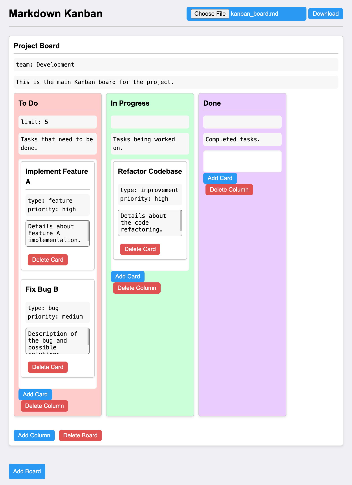

# Markdown Kanban Board

This project is a simple, interactive **Kanban board** built using HTML, CSS, and JavaScript, where users can create and manage boards, columns, and cards. It also supports importing and exporting board data in **Markdown format**.



## Features

- **Create Boards, Columns, and Cards**: Users can dynamically add, edit, and delete boards, columns, and cards.
- **Markdown Import/Export**: Supports uploading a Markdown file to generate a Kanban board and downloading the current board in Markdown format.
- **Drag-and-Drop**: Move cards between columns with drag-and-drop functionality.
- **Editable Content**: The titles, metadata, and descriptions for boards, columns, and cards are editable directly in the interface.

## How to Use

1. **Open the Application**: Open the `index.html` file in a web browser.
2. **Add Boards and Columns**: Click on `Add Board` to create a new board, then click `Add Column` to add columns to the board.
3. **Add Cards**: Click `Add Card` inside a column to create tasks, and edit their title, metadata, and description.
4. **Drag and Drop**: Rearrange cards by dragging and dropping them between columns.
5. **Download Board as Markdown**: Click the `Download` button to export the board as a Markdown file.
6. **Upload Markdown**: Use the `Upload` button to import a Kanban board from a Markdown file.

## File Descriptions

- **index.html**: The core of the project, containing the HTML, CSS, and JavaScript code to create the dynamic Kanban board. The JavaScript manages board creation, card manipulation, and Markdown parsing/exporting.
- **kanban_board.md**: A sample Kanban board in Markdown format, which demonstrates how a board, its columns, and cards are represented.
- **screenshot.png**: A visual representation of the Kanban board for reference.

## Example Markdown Structure

The Markdown format follows this structure:

```md
# Board Title

> key: value <!-- Optional metadata -->

Board description. <!-- Optional description -->

## Column Title

> hidden: false <!-- True hides the column -->
> limit: 5 <!-- Sets a work-in-progress limit -->

Column description.

### Card Title

> type: feature
> priority: medium
> tags: markdown, card, …
> assigned: person a, person b, …
> due: 13-05-2024

Card details.
```

You can easily modify this structure to suit your project’s needs.

## Installation and Setup

1. **Download or Clone the Repository**:
   ```bash
   git clone https://github.com/quclo/markdown-kanban.git
   ```
2. **Open the `index.html` file in a web browser** to use the Kanban board.

No additional setup is required.

## License

This project is licensed under the Apache License 2.0.
